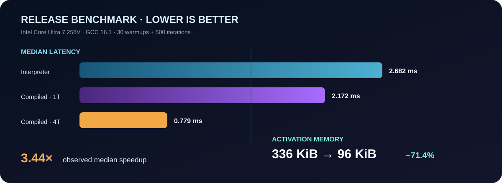
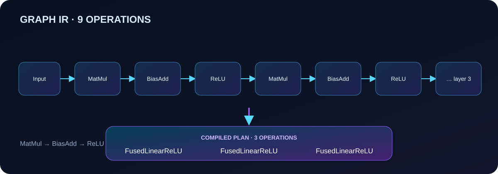
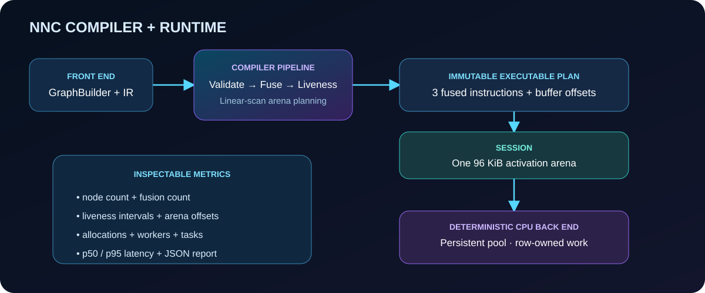

<div align="center">
  

# NNC — C++ Neural Inference Compiler & Runtime

**A dependency-free C++20 inference stack that turns a static neural graph into fused kernels, a reusable activation arena, and deterministic parallel execution.**

[](https://en.cppreference.com/w/cpp/20)
[](CMakeLists.txt)
[](tests)
[](LICENSE)
</div>

NNC is a compact systems project, not a wrapper around an existing ML framework. It owns the graph IR, validation, compilation passes, memory planning, kernels, worker pool, execution, and benchmark reporting. The included three-layer MLP produces identical output in the reference and optimized runtimes.

## Measured result



Release build on an **Intel Core Ultra 7 258V (8 cores), Windows 11, GCC 16.1**, using 30 warmups and 500 measured iterations:

| Mode | Median latency | p95 latency | Peak activations | Activation buffers/run |
|---|---:|---:|---:|---:|
| Serial interpreter | 2.682 ms | 3.676 ms | 336 KiB | 9 |
| Compiled, 1 thread | 2.172 ms | 2.742 ms | 96 KiB | 1 |
| Compiled, 4 threads | **0.779 ms** | **1.225 ms** | **96 KiB** | **1** |

That run observed **3.44× lower median latency** and **71.4% less activation memory** than the serial interpreter. These are measurements from one machine, not universal claims; rerun the benchmark on your hardware. The complete machine-readable result is in [`artifacts/benchmark.json`](artifacts/benchmark.json).

## What the compiler does



The demo is a static float32 MLP:

```text
[64,128] → Linear(128,256) → ReLU
         → Linear(256,128) → ReLU
         → Linear(128, 64) → ReLU
```

Each `MatMul → BiasAdd → ReLU` chain is lowered into one `FusedLinearReLU` instruction. Compilation then performs liveness analysis and linear-scan allocation. The first and third activation buffers have disjoint lifetimes, so they share the same arena offset. A persistent worker pool partitions output rows deterministically; every worker owns disjoint output elements and preserves dot-product accumulation order.



## Quick start

Requirements: CMake 3.20+ and a C++20 compiler.

```bash
cmake -S . -B build -DCMAKE_BUILD_TYPE=Release
cmake --build build --parallel
ctest --test-dir build --output-on-failure
```

Run the readable plan demo:

```bash
./build/nnc_demo
```

Run a reproducible benchmark and write JSON:

```bash
./build/nnc_benchmark \
  --threads 4 --warmup 30 --iterations 500 \
  --json artifacts/benchmark.json
```

On multi-config generators such as Visual Studio, add `--config Release` to the build, test, and executable paths.

## Runtime guarantees

- **Validated boundaries:** positive static dimensions, checked element-count overflow, constant payload sizes, topological value availability, legal matrix/bias shapes, runtime input IDs, and runtime input shapes.
- **Numerical equivalence:** fused and unfused kernels use the same serial accumulation order; the benchmark refuses to run if maximum absolute error exceeds `1e-5`.
- **Safe reuse:** buffers expire only when `last_use < next_producer`; inputs consumed by an instruction can never alias its output.
- **Deterministic threading:** output rows are partitioned by worker index, with no shared writes. Repeated multi-thread runs are bit-identical in the test suite.
- **One activation allocation:** the compiled runtime allocates one arena per invocation and creates no per-instruction activation buffers.
- **Inspectable plans:** compiled instructions, liveness intervals, offsets, arena capacity, fusion count, node count, and worker count are exposed as structured C++ data.

## Project map

```text
include/nnc/nnc.hpp       Public graph, compiler, runtime, and stats API
src/nnc.cpp               Validation, passes, planner, kernels, worker pool
apps/demo.cpp             End-to-end model execution and plan inspection
benchmarks/benchmark.cpp  Three-mode latency/memory benchmark + JSON output
tests/                    Unit, integration, deterministic-threading, CLI E2E
docs/images/              Hero, architecture, graph, and benchmark visuals
artifacts/                Reproducible benchmark output and methodology
.github/workflows/ci.yml  Linux/Windows builds, tests, sanitizers, coverage
```

## Scope and tradeoffs

NNC intentionally supports contiguous float32 tensors, static shapes, CPU inference, `MatMul`, `BiasAdd`, `ReLU`, and their fused form. It does not claim ONNX compatibility, quantization, dynamic shapes, SIMD dispatch, GPU execution, or training. Those are natural extensions, but keeping the core small makes every compiler and runtime mechanism easy to inspect.

The primary memory metric is exact activation payload/arena capacity. “Activation buffers/run” counts only buffers created for operator outputs or the compiled arena; the equally present returned-output allocation and bookkeeping containers are excluded. Immutable weights, executable code, stack use, allocator metadata, and process RSS are also excluded from this narrowly defined activation-workspace comparison.

## Development checks

```bash
# Sanitizers on GCC/Clang
cmake -S . -B build-sanitize -DNNC_ENABLE_SANITIZERS=ON -DCMAKE_BUILD_TYPE=Debug
cmake --build build-sanitize --parallel
ctest --test-dir build-sanitize --output-on-failure

# Coverage instrumentation on GCC/Clang
cmake -S . -B build-coverage -DNNC_ENABLE_COVERAGE=ON -DCMAKE_BUILD_TYPE=Debug
cmake --build build-coverage --parallel
ctest --test-dir build-coverage --output-on-failure
gcovr --root . --filter src \
  --exclude-throw-branches --exclude-unreachable-branches \
  --fail-under-line 80 --fail-under-function 80 --fail-under-branch 80
```

## License

MIT — see [`LICENSE`](LICENSE).
